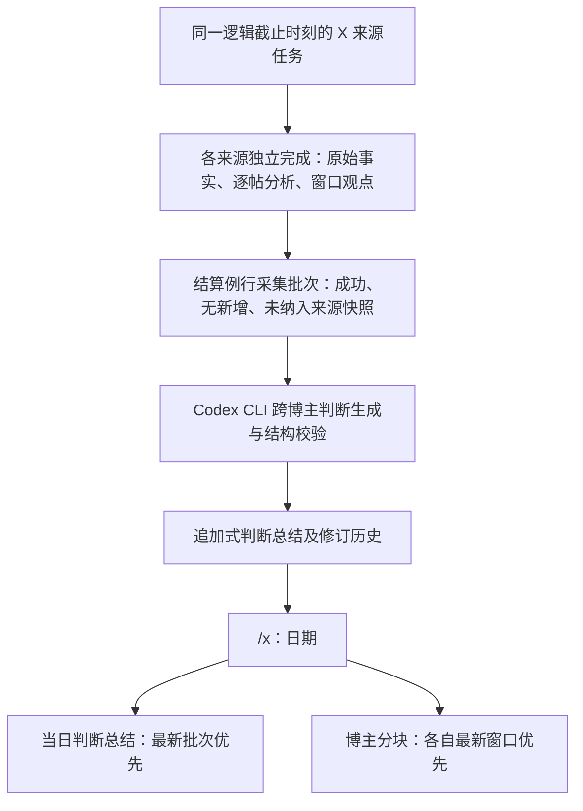

# X 跨博主当日判断总结 Spec

## 文档状态

- 阶段：V2 受控生产试运行的阅读与理解能力增补
- 状态：**待用户审阅；本文不授权实现、迁移、部署或真实采集。**
- 日期：2026-07-31
- 关联：[V2 X 指定博主信息收集与阅读 Spec](2026-07-22-v2-x-information-collection-and-reader-design.md)、[X 阅读页全量筛选与管理员入口设计](2026-07-26-x-reader-all-filters-design.md)、[项目状态](../../project-status.md)

## 1. 问题本质与目标

现有 X 阅读页已能安全展示每位博主在每个上海自然日内、按采集窗口生成的独立观点段及逐帖证据。但读者仍需自行横向比较多个博主，才能判断他们对同一标的、市场或行业是形成共识、存在分歧，还是证据不足。把原有博主卡片简单堆叠，不能解决这个跨来源理解成本。

本增补的目标是在每个例行 X 采集批次完成后，基于该批次内已经持久化、可追溯的各博主窗口观点，生成一份追加式的“当日判断总结”。它只归纳输入中可验证的博主观点，不生成系统自身的投资建议。阅读页的正常层级调整为“日期 → 当日判断总结 → 按博主分块的观点”，使读者先看跨博主结论，再回到最近窗口的单博主原始证据。

当前真实 LLM Provider 仍是本机已登录的 Codex CLI，而非直接调用 ChatGPT API；仓库未固定 `--model`，实际模型由该 Worker 的 Codex 默认配置决定。实现时必须记录 Provider、`model_reported`、Prompt/Schema 版本和输入证据身份，供受控审计使用；这些运行信息不得进入普通读者页面。

## 2. 范围、非目标与方案选择

本 Spec 只增加 X 的跨博主当日判断记录、其独立生成流程和 `/x` 的阅读投影；保留现有博主、日期筛选控件及单博主逐帖证据能力。不修改 OpenCLI 采集合同、来源身份、覆盖水位、checkpoint、既有单博主窗口观点的含义，也不启动 Discord/X 统一阅读、Module 2 选股研判、个性化推荐或交易执行。

设计评估过三种触发方式。第一种是每个博主任务成功后立即生成跨博主总结，但同一例行窗口会产生多份不同覆盖范围的“当日总结”，读者无法判断哪一份才代表一次采集。第二种是等待所有来源成功才生成一份总结，但单来源故障会阻断其余正常来源的阅读价值，违反既有失败隔离原则。本文采用第三种：以一个上海逻辑截止时刻的来源集合形成一个**例行采集批次**，在该批次结算后生成一份有明确覆盖范围的总结；成功来源进入输入，未完成或失败来源明确列为未纳入原因。这个选择保留“一次例行采集对应一条记录”的语义，也不把来源失败伪装为没有观点。

## 3. 例行采集批次与持久化契约

“例行采集批次”由调度器为某个上海逻辑截止时刻创建，其身份至少包含 `natural_date`、`cutoff_at`、创建时的启用且已解析 X 来源快照，以及对应的每来源范围任务。来源在批次创建后新启用、归档或更改，不得回写或改变该批次的来源快照。批次不是新的采集范围：每个来源仍按既有独立范围、回执和 checkpoint 契约完成。

当该批次的来源任务均已结算，或达到 Plan 中定义的结算时限时，系统创建一条不可变的当日判断总结记录。任务成功且有已持久化窗口观点时，其对应观点段可以作为输入；成功但无新增帖子时记为“已检查，无新信息”；终态失败、延迟、未解析、重试超时或被隔离来源记为“未纳入”，并附安全失败类别。总结记录的覆盖状态只有以下三种：`complete`（快照中的所有来源均结算且没有未纳入来源）、`partial`（至少一个来源未纳入）和 `no_new_information`（所有可用来源均完成，但没有可归纳的新增观点）。

判断总结生成是采集完成之后的独立、可重试工作，不能反向阻断已经符合现有契约的每来源原始事实、分析、窗口观点持久化或 checkpoint 推进。若这个生成工作失败，批次保留 `judgement_pending` 或 `judgement_failed` 的审计状态，并只重试该总结；Reader 必须显示“当日判断总结暂不可用”，但仍展示单博主观点，绝不能把失败显示为“无新信息”。这保证新增理解层不会降低既有采集链路的可恢复性。

每份总结保存输入窗口段、分析和来源身份的不可变引用，以及输出的 schema/prompt/provider 遥测。补偿性重试成功时，为同一采集批次创建递增的**总结修订版本**，不覆盖旧文本；Reader 默认显示该批次最新修订，同时允许查看较早修订及其覆盖范围。不同采集批次按 `cutoff_at` 倒序显示，最近批次始终在最上方。

## 4. 判断内容、模型输入与可验证性

模型只可读取该采集批次中已经持久化的单博主窗口观点、逐帖分析的博主观点/论据/不确定性、帖子与分析身份、博主显示名，以及引用或回复上下文的可见性限制。模型不得把原始帖正文、未解析图片/PDF/视频/外部文章正文、范围外帖子、旧批次总结文本或无评论转发的被转发内容当作新证据。它也不得从模型记忆补足事实。

输出固定为以下两个主题；任一主题没有足够输入时，必须明确写“本次没有形成可验证的判断”，而不是凑足内容。

| 主题 | 允许表达 | 每条判断的必备可追溯字段 |
| --- | --- | --- |
| 个股观点 | 某标的或公司上的一致观点、条件性观点、相反判断与尚待观察的变量。 | 判断文本、支持博主、持不同或保留意见的博主、输入分析/帖子证据身份、不确定性。 |
| 股票市场与行业判断 | 宽盘、行业、风格或产业链的方向、机会、风险与条件。 | 判断文本、支持博主、相反/保留意见的博主、输入分析/帖子证据身份、不确定性。 |

每条判断的读者文案必须清楚区分“部分博主认为”“多位博主一致认为”“另一部分博主提示”与“证据不足”，不得把博主的操作倾向改写为系统建议。例如“部分博主认为海力士接近估值底部（博主 1、博主 2），但博主 3 认为杠杆尚高、需要继续观察”是合格表达；“应当买入海力士”不是。没有足够独立博主支持时，不得使用“共识”或“市场已确认”等强确定性措辞。

输出 schema 必须将两个主题分开，且每条判断均能校验其 `supporting_source_ids`、`dissenting_source_ids`、`analysis_ids` 与 `evidence_post_ids` 都属于同一批次的已接受输入。模型引用的博主必须与证据来源一致；重复同一博主的多条帖子不能被计作多位博主。结构校验、身份校验或持久化失败均视为该总结版本失败，不得写入 Reader 当前版本。

## 5. `/x` 信息架构与筛选语义

`/x` 保留现有“博主”和“日期”筛选控件、默认“全部”的交互、URL 查询参数及权限边界。默认的全部博主、全部日期视图按日期倒序组织；每个日期块内的顺序固定为：当日判断总结、按博主分块的观点、逐帖证据入口。判断总结中的采集批次记录按截止时刻倒序，最新一条默认展开，较早记录默认折叠。

单博主观点不再按网格把所有博主并列，而是以博主作为稳定分块。每个博主块先展示该日最近成功采集窗口的观点、窗口时间和逐帖证据入口；较早窗口在同一博主块内按时间倒序折叠。这样“最新信息”有明确含义：它是该博主最近一个已成功持久化的窗口，而不是页面最近一次渲染或其他博主的更新时间。只有已完成且无新增数据的窗口可以显示无新增；处理中、失败或未纳入来源必须显示各自状态。

跨博主判断只在“全部博主”视图显示，因为其结论和博主名单来自该批次来源快照，不能在单博主筛选后安全地删改成另一份结论。当用户选择单一博主时，日期与该博主分块仍正常展示，跨博主位置显示简短说明：“跨博主当日判断总结仅在全部博主视图展示。”这不改变筛选项本身，避免让一个包含其他博主证据的结论在筛选后看似只由单一博主支持。

当日判断总结默认只展示判断文字、博主显示名标签、覆盖状态、采集截止时刻、未纳入来源数量和不确定性；不展示原始正文、内部 ID、任务 ID、Prompt、完整模型响应、Cookie、Profile、Provider 诊断或本地 evidence 路径。读者可从博主标签进入该日期的对应博主块，再从其中打开安全的原帖链接和逐帖分析。普通用户与管理员共享相同的阅读投影；后台任务与运行诊断继续受管理员权限保护。

## 6. 数据、安全与兼容性边界

实施需要新增概念上的采集批次、批次来源快照、判断总结版本及其证据引用，并扩展 Reader-safe DTO；具体表、RPC、索引、RLS 和回滚策略由独立 implementation plan 提出并批准后才可实施。既有 `x_daily_viewpoint_segments`、`x_post_analyses` 与每来源范围完成记录保持不可变事实；当日判断总结只引用它们，不能修改、合并或重写它们。现有单博主窗口总结 Prompt 也保持其“仅本窗口”的输入边界。

新增数据必须追加式保存，普通用户只读安全投影，管理员也不得通过页面获取原始证据正文或敏感本地资料。来源失败详情只能以已有安全分类和“未纳入”数量向读者表达；不得公开来源私密名称、登录态、浏览器会话或错误堆栈。新能力必须沿用项目的一年原始内容保留与摘要长期保留策略；原始内容到期后，总结历史仍保留，但证据入口准确标为不可用。

## 7. 验收标准

1. 一个例行截止时刻只形成一个逻辑采集批次；其来源快照和每来源任务关系可审计，且后续来源配置变化不改变已生成批次。
2. 所有来源成功时，生成一条 `complete` 判断总结；任一来源失败、延迟或隔离时，仍可生成 `partial` 总结，并明确其未纳入范围，不阻断健康来源的单博主阅读或 checkpoint。
3. 所有完成来源均无新增观点时，持久化 `no_new_information` 记录而不调用模型虚构判断；Reader 明确显示这一状态。
4. 输出严格只有“个股观点”与“股票市场与行业判断”两类；每条判断可回溯到同批次、已验证的博主和分析/帖子身份，并正确呈现支持与相反或保留意见。
5. 输入越界、伪造来源、重复计数、Schema 不合法、Provider 失败或持久化失败均不会形成当前 Reader 版本；失败可单独重试，不影响既有 X 采集完成语义。
6. 同一批次的重试成功创建新的修订版本，旧版本不被覆盖；Reader 默认显示最新修订，历史可追溯。
7. `/x` 的全部视图按日期倒序，日期内先显示当日判断总结（最新批次默认展开），再显示博主块；每个博主块内最近成功窗口默认展开，历史窗口倒序折叠。
8. 博主和日期筛选控件、默认值与 URL 语义保持现状；单博主筛选不显示被错误裁剪的跨博主结论，而显示上述范围说明。
9. 普通用户页面/API 不含原始正文、内部身份、任务/运行诊断、Prompt、Provider、Cookie、Profile 或本地证据路径；管理员任务控制面继续受角色校验与 RLS 限制。
10. 公开人工 fixture、数据库契约、Worker、Reader 组件/API、权限、失败隔离、桌面/375px 响应式、生产构建和脱敏检查全部通过；真实生产验收仅在独立 Plan 获批及用户再次明确授权后执行。

## 8. 后续门禁

本文经用户审阅并批准后，下一步只能编写独立 implementation plan。该 Plan 必须细化批次结算时限、任务与重试协调、最小数据迁移/RLS/RPC、输入/输出 schema、Prompt 版本、Provider 遥测、幂等与修订规则、Reader API/组件测试、回滚顺序以及生产验收步骤。计划未获批准前，不得修改代码、Prompt、数据库、任务调度、部署或真实生产数据。

## 9. Spec 自检

本文把“跨博主判断”限定为已持久化事实上的可追溯归纳，而不是新的投资决策系统；一条例行批次有明确来源快照、覆盖状态和版本历史；来源失败不阻断健康采集；筛选时不伪造跨博主结论；原有单博主窗口、事实、证据和安全边界均保持有效。
