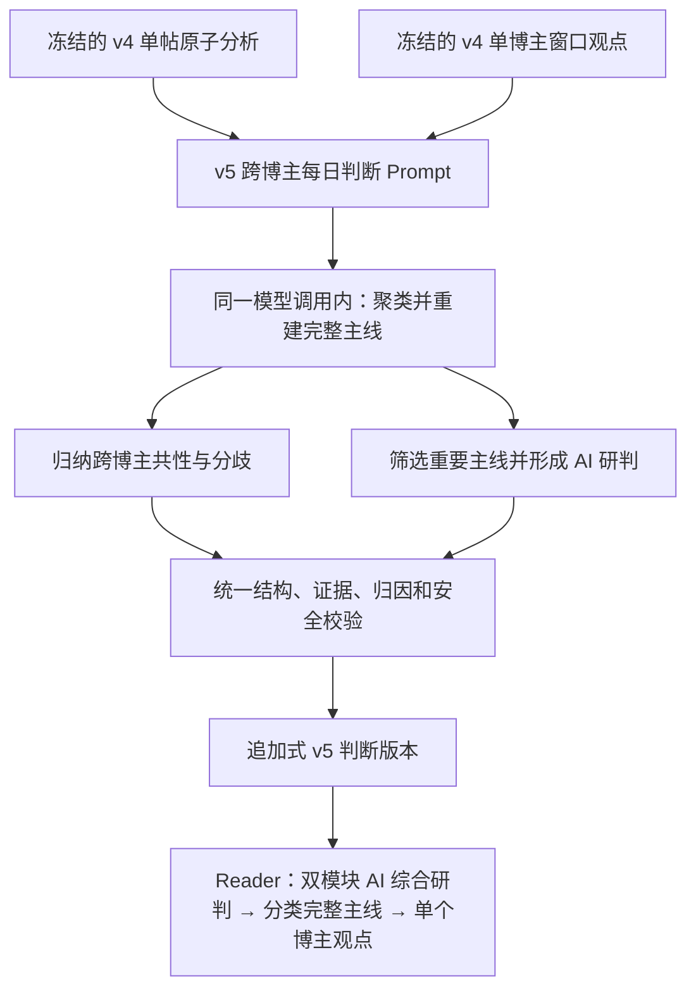

# X 每日判断完整主线与双模块 AI 综合研判 v5 Spec

## 文档状态

- 阶段：V2 受控生产试运行的阅读与理解能力修订
- 状态：**待书面复核；方案 B、A 生成方式、双模块合同、重要性边界和页面线框已由用户于 2026-08-08 确认**
- 日期：2026-08-08
- 关联：[X 跨博主当日判断总结 Spec](2026-07-31-x-cross-blogger-daily-judgement-summary-design.md)、[X 判断对象范围与阅读展示设计](2026-08-05-x-judgement-scope-and-reader-presentation-design.md)、[X Reader 分类模块与帖子默认折叠设计](2026-08-07-x-reader-category-modules-and-collapsed-posts-design.md)、[项目状态](../../project-status.md)

## 1. 问题本质

当前 v4 单博主窗口 Prompt 和跨博主每日判断 Prompt 都以“可独立理解的原子判断”为输出单位，并要求不同判断、操作倾向或条件拆分。这个约束有利于底层事实提取、来源归属和证据校验，但每日判断层也继续使用同一原子化目标，导致同一条投资逻辑的结论、条件、情景分支和操作含义被生成成多个平级观点。

现有 v4 Schema 将每个数组项表示为一条 `statement`、一个 `action_intent` 和若干条件；Worker、数据库和 Reader 逐项校验、持久化与编号展示。它们能够拒绝伪造证据或错误归因，却不能表达“一条完整判断中存在多个条件分支和不同博主操作”，也不能识别多个合法数组项其实属于同一条因果链。页面逐项显示“观点 01/02/03”后，生成层的拆分被进一步放大。

这不是单纯的页面样式问题，也不是模型偶发失误，而是当前产品目标和生成合同不一致：每日判断总结应当降低用户横向比较和重组观点的成本，当前合同却优化为展示尽可能多的证据原子。

## 2. 目标、范围与非目标

本修订将跨博主每日判断的最小阅读单元从“原子观点”改为“完整判断主线”。系统必须在不损失条件、分歧、操作归因和证据关系的前提下，把属于同一对象、同一核心命题、同一因果链或同一情景树的内容重新组织为一条完整判断。

每日判断还新增“AI 综合研判”总容器，内部严格区分两个模块。“跨博主观点整合”只归纳至少两位博主相关主线中的共性、矛盾和条件差异；“AI 研判”由模型选择真正重要的单博主或多博主主线，给出输入范围内的逻辑、证据、假设、风险和验证变量判断。两个模块均可输出零到多条，不要求覆盖全部博主或全部主题，也不允许把无关内容强行融合为一个总判断。

本次只升级正常跨博主每日判断合同。v4 单帖分析和 v4 单博主窗口继续承担忠实、原子、同源的证据整理职责；不修改 X 采集、来源身份、checkpoint、任务调度、coverage、Provider 选择、原始内容保留期或单博主阅读合同。新增能力仍属于模块 1 的信息理解层，不进入模块 2 的选股研判、个性化组合建议、仓位决策或交易执行。

跨博主观点整合只能说明博主共同说了什么，不表达模型赞成或反对。AI 研判可以表达模型自己的分析判断，但不得调用外部知识、模型记忆、网页检索或未提供事实，不能把输入内证据支持程度写成客观事实真伪，也不得生成系统自己的买入、卖出、加仓、减仓、建仓、清仓、抄底或追涨建议。允许提出的“观察建议”仅限于从已纳入观点的条件、不确定性和分歧中提炼需要继续验证的变量。

## 3. 方案选择与职责边界

本设计采用方案 B 的新 v5 分层合同和用户确认的 A 生成方式：一次 Provider 调用同时形成完整主线、跨博主观点整合和 AI 研判，不增加第二次生产模型调用。

| 层级 | 版本与职责 | 本次是否改变 |
| --- | --- | --- |
| 单帖分析 | `v4-x-post-analysis`：忠实提取一条帖子中的观点、条件、论据、操作表述和证据 | 否 |
| 单博主窗口 | `v4-x-window`：整理同一博主、同一完成窗口内的原子观点 | 否 |
| 跨博主每日判断 | `v5-x-cross-blogger`：重建完整主线，并分别形成跨博主整合与重要观点 AI 研判 | 是 |
| Reader | v2/v3/v4 保持历史兼容；v5 使用完整主线和双模块 AI 综合研判布局 | 是 |

正常生产 Prompt/version 固定新增为 `v5-x-cross-blogger-1` / `v5-x-cross-blogger`。v2、v3 和 v4 历史记录保持不可变并继续按原合同读取，不改写、不伪装为 v5。只有后续正常生成或经管理员显式授权、基于既有冻结输入的再生成可以产生 v5 版本；本设计不授权自动历史回刷、重新采集或直接修改既有判断 JSON。

## 4. v5 输出合同

### 4.1 顶层结构

模型只输出一个严格 JSON 对象，概念结构如下：

```json
{
  "schema_version": "v5-x-cross-blogger",
  "ai_synthesis": {
    "cross_blogger_integrations": [],
    "ai_assessments": []
  },
  "security_industry_theses": [],
  "market_structure_theses": [],
  "strategy_mindset_theses": [],
  "uncertainties": []
}
```

三类 `theses` 继续保留“个股与产业”“市场结构”“投资策略与心态”的分类边界，但数组项不再代表孤立事实，而代表一条完整判断主线。`ai_synthesis` 只是两个不同事实身份模块的结构化容器，不代表一个强行覆盖全部内容的总判断。顶层 `uncertainties` 只承载批次整体覆盖或输入限制，不重复单条主线的不确定性。

### 4.2 完整判断主线

每条 thesis 使用以下字段：

```json
{
  "thesis_id": "security-01",
  "headline": "一句话核心结论",
  "synthesis": "连接原因、方向、条件、时间关系和操作含义的完整阐述",
  "scenario_branches": [{
    "condition": "已表达的分支条件",
    "outcome": "在该条件下的判断结果",
    "source_ids": ["输入 source_id"],
    "analysis_ids": ["输入 analysis_id"],
    "evidence_post_ids": ["输入 evidence_post_id"],
    "uncertainties": ["该分支的限制"]
  }],
  "attributed_actions": [{
    "source_id": "明确表达操作的输入 source_id",
    "action_intent": "build_position | buy | add | hold | reduce | sell | watch | avoid",
    "action_scope_status": "specified | unspecified",
    "action_scope": "仅 specified 时填写明确对象，否则为空字符串",
    "conditions": ["该博主已表达的操作条件"],
    "analysis_ids": ["直接支持该操作的输入 analysis_id"],
    "evidence_post_ids": ["对应帖子证据"],
    "uncertainties": ["对象、条件、时间或证据限制"]
  }],
  "supporting_source_ids": ["支持该主线的输入 source_id"],
  "dissenting_source_ids": ["反对或保留意见的输入 source_id"],
  "analysis_ids": ["覆盖整条主线的输入 analysis_id"],
  "evidence_post_ids": ["覆盖整条主线的帖子证据"],
  "uncertainties": ["证据、时间、对象或适用范围限制"]
}
```

`thesis_id` 只用于同一份输出内部关联和 Reader 稳定渲染，不向普通读者展示。类别前缀固定为 `security-`、`market-` 和 `strategy-`，同类编号从 `01` 连续递增且全局唯一。

`scenario_branches` 用于表达同一判断下的条件路径，例如不同政策兑现程度对应的递进结果。分支在 Reader 中嵌入所属主线，不能升格为新的“判断主线”编号。没有真实条件分支时数组为空，不能为了展示结构而凑分支。

`attributed_actions` 按博主分别记录明确操作。不同博主在同一主线下表达不同操作时，仍保留在同一主线中，并通过来源、条件与必要的 `dissenting_source_ids` 呈现；不能因为 v4 的单一 `action_intent` 限制而拆成多个平级判断。没有明确操作时数组为空，不能从走势、情绪或行业判断推断操作。`specified` 必须有明确非空对象；`unspecified` 必须使用空 `action_scope`，并在该操作的 `uncertainties` 中说明对象未明确。

### 4.3 AI 综合研判

`ai_synthesis` 必须精确包含 `cross_blogger_integrations` 与 `ai_assessments` 两个数组。两者在内容身份、准入门槛和 Reader 样式上保持分离，任一数组都允许为空。

#### 4.3.1 跨博主观点整合

`cross_blogger_integrations` 回答“不同博主共同说了什么、哪里矛盾、条件或时间尺度有什么差异”，不能表达模型自己的赞成、反对或投资判断。每条结构为：

```json
{
  "integration_id": "integration-01",
  "headline": "跨博主整合标题",
  "synthesis": "对相关博主主线的忠实归纳和比较",
  "common_points": [{
    "statement": "跨博主共性",
    "source_ids": ["表达该共性的输入 source_id"],
    "related_thesis_ids": ["security-01"]
  }],
  "conflict_points": [{
    "issue": "方向、假设、条件或时间尺度上的争议焦点",
    "positions": [{
      "position": "一组博主的具体立场",
      "source_ids": ["表达该立场的输入 source_id"],
      "related_thesis_ids": ["security-01"]
    }]
  }],
  "related_thesis_ids": ["security-01", "market-01"],
  "uncertainties": ["该整合的覆盖和归纳限制"]
}
```

`integration_id` 固定使用 `integration-01`、`integration-02` 等连续编号，在当前输出内唯一，只用于内部关联和稳定渲染，不向普通读者展示。

每条整合只组合语义上真正相关的 thesis，可以只涉及部分博主和部分主题。相关 thesis 的支持与反对来源并集必须至少包含两位独立博主；可以引用一条已经聚合多位博主的 thesis，也可以引用多条相关 thesis。每个共性点必须明确列出至少两位表达该共性的独立博主；每个矛盾点必须包含至少两个非空立场，各立场分别标明来源，且各立场来源的并集至少包含两位独立博主。共性点和矛盾立场引用的 source 与 thesis 必须属于该条整合的关联集合，顶层 `related_thesis_ids` 等于所有子项关联 thesis 的去重并集。不同标的、产业、核心问题或时间尺度原则上分开；只有输入本身建立了明确比较或共同因果关系时，才允许跨对象整合。没有真实跨博主关系时数组为空。

`common_points` 和 `conflict_points` 至少一项非空；不能为了填满版式而虚构共性或分歧。输出数量没有机械上限，Prompt 应要求用覆盖真实独立关系所需的最小集合，既不生成一个“大一统整合”，也不重复拆分同一关系。

#### 4.3.2 AI 研判

`ai_assessments` 回答“AI 对重要判断主线怎么看”。它可以针对单个博主的重要 thesis，也可以针对多博主 thesis 或多条相关 thesis；不适用跨博主整合的两来源最低门槛。每条结构为：

```json
{
  "assessment_id": "assessment-01",
  "headline": "AI 研判标题",
  "judgement": "仅在当前输入范围内成立的 AI 判断",
  "importance_reason": "为什么该主线值得额外研判",
  "reasoning": "对逻辑、证据和条件关系的分析",
  "key_assumptions": ["判断成立所依赖的输入内假设"],
  "risks": ["输入已经暴露的主要风险或缺口"],
  "watch_variables": ["可验证或推翻判断的输入内变量"],
  "related_thesis_ids": ["market-01"],
  "uncertainties": ["AI 推理的范围和确定性限制"]
}
```

`assessment_id` 固定使用 `assessment-01`、`assessment-02` 等连续编号，在当前输出内唯一且不向普通读者展示。`related_thesis_ids` 至少包含一条合法 thesis，因此重要的单博主主线可以进入 AI 研判；重要性筛选只影响该模块，不会从下方分类判断中删除未入选 thesis。

AI 研判只选择真正重要且能产生新增分析价值的最小集合，不设置机械数量配额。至少满足下列一项才可成为候选：可能影响宽盘、重要行业或明确标的判断；包含明确操作、目标、触发或失效条件；存在实质共识或矛盾；条件分支会导向明显不同结果；能解释多条其他主线；证据具体且值得继续验证。

轻微、重复、纯情绪、对象与时间范围均不明确、缺少论据或条件、以及模型只能换句话复述的 thesis 不进入 AI 研判。`judgement` 必须明确限定为“在当前输入范围内”的判断，可以评价逻辑是否自洽、证据是否充分、条件是否完整、风险和观察变量是什么，但不能宣称观点客观正确或错误，不能补充外部事实，也不能转化为系统交易建议。

## 5. 聚类、合并与拆分规则

模型生成前必须先根据输入中的对象、核心命题、因果关系、时间尺度、条件和操作归因形成候选主线，再输出 v5 JSON。规则如下：

1. 同一对象和核心命题下，一项内容若是另一项的原因、条件、后果、情景分支、风险、失效条件或操作含义，必须合并为同一 thesis。
2. 对同一核心问题持相反或保留立场的博主进入同一 thesis，通过支持、不同观点和分歧阐述呈现；不能把反对意见拆成无关联观点。
3. 不同博主的不同操作表述不会自动触发拆分，必须按来源进入 `attributed_actions`。
4. 不同标的、产业或独立核心问题原则上拆分；不同时间尺度原则上拆分，除非输入明确将它们组织成同一递进情景或因果链。
5. 仅有表面关键词相似、但对象、命题或证据关系不同的内容不得合并。
6. 不设置观点数量配额。没有证据的类别为空；不能为了“每日总结看起来丰富”而补足条目。

## 6. 数据流与一次生成边界



本次固定使用 A 生成方式，不新增第二次生产模型调用或运行时语义聚类器。Worker 继续向一次 Provider 调用提供冻结的 included sources、v4 窗口输出和 v4 单帖分析；Prompt 在同一调用内先形成完整 thesis，再生成 `cross_blogger_integrations` 和 `ai_assessments`，最后完成静默自检。程序不根据文字相似度自行合并输出，也不在前端二次生成 AI 判断。

当前真实 Provider 边界继续是本机 Codex CLI；仓库没有固定底层模型名称。因此 Reader 标题使用“AI 综合研判”，不使用“ChatGPT 观点和建议”，也不向普通读者展示 Provider、模型遥测、Prompt 或内部 ID。

## 7. 校验、安全与 Prompt Eval

### 7.1 确定性生产校验

Worker Runtime、Protocol、控制面完成接口和数据库 authority 必须共同执行以下确定性校验：

- 顶层、`ai_synthesis`、thesis、情景分支、博主操作、跨博主整合和 AI 研判字段精确，无缺失或额外字段；版本必须为 v5。
- thesis、integration 与 assessment ID 格式、类别前缀、连续编号、唯一性和引用闭包正确。
- 每条 thesis 的 `supporting_source_ids`、`analysis_ids` 和 `evidence_post_ids` 必须非空；来源、analysis 和帖子必须属于同一冻结批次且归属一致。
- 每个情景分支和 attributed action 的来源、analysis 与 evidence 必须是所属 thesis 证据集合的同源子集。
- attributed action 的 intent、scope status、scope 和 uncertainties 必须符合 `specified` / `unspecified` 一致性规则；同一来源的完全相同操作项不得重复。
- 每条跨博主整合的 `related_thesis_ids` 必须非空、唯一并引用当前输出中的 thesis；相关 thesis 来源并集至少包含两位独立博主，且共性与分歧至少一项非空。每个共性点至少引用两位独立来源；每个矛盾点至少有两个非空立场且立场来源并集至少包含两位独立博主；子项来源必须属于其引用 thesis，顶层关联 thesis 必须等于子项关联 thesis 的去重并集。
- 每条 AI 研判的 `related_thesis_ids` 必须非空、唯一并引用当前输出中的 thesis，但允许只关联一条单博主 thesis；其判断、重要性理由和推理必须为非空安全文本。
- excluded sources 和无新增来源只能形成覆盖说明，不能成为 thesis 或 AI 判断证据。
- 强共识措辞仍要求至少两位独立支持来源且没有反对或保留来源。
- 自然语言字段不得泄露 source、analysis、post、batch、run 或 segment 等内部 ID，不得包含系统买卖指令或不安全运行信息。AI 研判不得出现输入不存在的数字、标的、事件或事实性断言。

任一确定性校验失败时，整个 v5 completion 失败，不持久化部分输出，也不由 Reader 或后处理代码尝试修补语义。

### 7.2 语义质量与 Prompt Eval

“是否过度拆分”或“是否错误合并”不能仅靠 JSON Schema、关键词或文本相似度可靠判断，因此生产解析器不承担语义猜测。发布前 Prompt Eval 必须增加人工构造的公开 fixture，至少覆盖：

- 同一因果链中的结论、条件和操作应合并；
- 同一情景树的递进分支应嵌入一条 thesis；
- 多位博主使用不同措辞表达同一命题时应形成跨博主共性；
- 同一命题的相反立场应作为跨博主分歧保留；
- 无关标的或不同时间尺度不得错误合并；
- 单来源 thesis 不得生成跨博主整合，但重要且可分析时可以生成 AI 研判；
- 没有真实跨博主关系时 `cross_blogger_integrations` 应为空；
- 重要单博主主线的逻辑、证据、假设和风险可以被 AI 研判，普通或只能复述的主线不应入选；
- AI 研判的选择不能删除、降级或隐藏未入选的分类主线；
- excluded source、提示注入、条件升级为确定事实和输入外知识必须失败。

Eval 顺序固定为确定性合同检查，再使用受约束的语义 Judge 检查碎片化、错误合并、跨博主整合是否忠实、重要性选择是否合理、AI 研判是否增加分析价值以及是否存在不受支持的推理；严重或不确定结果进入人工复核。Judge 只用于发布前评估，不成为第二次生产调用，也不能覆盖确定性证据、安全或归因失败。

仓库只提交人工构造的公开 fixture。真实博主内容、截图、生产 Prompt 补充、完整模型响应和真实证据即使脱敏也不得进入 Git。

## 8. Reader 信息架构

全部博主视图中，每个成功批次按以下顺序展示：

```text
当日判断总结
├── 输入覆盖
├── AI 综合研判（任一子模块非空时显示）
│   ├── 跨博主观点整合
│   │   └── 整合 01/02...
│   └── AI 研判
│       └── AI 研判 01/02...
├── 个股与产业判断
│   └── 判断主线 01/02...
├── 市场结构判断
│   └── 判断主线 01/02...
├── 投资策略与心态
│   └── 判断主线 01/02...
└── 批次整体不确定性
```

AI 综合研判置于分类主线之前，作为两个子模块的共同容器，并固定显示“仅基于本批次已纳入的博主观点，不获取外部信息，不构成交易建议”。“跨博主观点整合”使用博主观点归纳的视觉身份，逐项展示共性与分歧，并在每个共性和矛盾立场旁显示对应博主，不出现 AI 赞成或反对；“AI 研判”使用独立 AI 分析身份，展示判断、重要性理由、推理、假设、风险与观察变量。两个子模块使用不同的低饱和强调色、身份标签和标题，不能只靠文案细微差异区分。

两个子模块中的条目都纵向排列，不存在一个强行覆盖所有内容的总览。任一子模块为空时只隐藏该子模块；两者均为空时隐藏整个 AI 综合研判容器。未参与跨博主整合或 AI 研判但仍有价值的 thesis 继续保留在下方分类中，不因未被引用或未被选为“重要观点”而隐藏、降级或删除。

每条 thesis 依次展示标题、连续综合阐述、可选情景分支、按博主归因的操作表述、支持/不同观点和不确定性。情景分支作为所属主线内部的“情景 A/B/C”显示，不使用新的“判断主线”编号。类别为空时继续隐藏，不显示凑数文案。

现有日期、博主筛选、批次倒序、最新批次默认展开、历史修订折叠、单博主分块和最新窗口优先行为保持不变。跨博主判断及 AI 综合研判仍只在“全部博主”视图显示；单博主筛选不能裁剪或伪造跨博主结果。桌面端和 375px 移动端保持同一纵向语义顺序。

Reader-safe DTO 只映射可读标题、阐述、情景、操作显示、博主显示名、跨博主共性/分歧、AI 判断/推理/重要性理由/假设/风险/观察变量和不确定性；不得输出 thesis/integration/assessment 内部关联 ID、source/analysis/post ID、原始正文、Prompt、Provider、任务诊断、Cookie、Profile 或本地路径。

## 9. 失败处理、兼容性与发布边界

- `no_new_information` 批次继续不调用 Provider；有新增但没有可验证投资判断时允许三类 thesis、跨博主整合和 AI 研判全部为空，并准确保留覆盖说明。
- v5 Provider、JSON、Schema、证据、归因或持久化失败只使当前判断 run 失败，不影响已持久化的帖子、单帖分析、单博主窗口、coverage 或 checkpoint。
- v5 不合法时不得降级持久化为 v4，也不得把半成品展示为当前版本。Reader 继续保留同批次既有成功修订或显示当前判断失败状态。
- partial 批次可以生成 v5，但跨博主整合和 AI 研判都必须继承批次覆盖限制；未纳入来源不能被解释为没有反对意见或不影响 AI 判断。
- v2、v3 和 v4 历史记录继续使用现有兼容投影；不自动改写或回刷。
- 正常 v5 发布必须在 Prompt、Runtime、Worker Protocol、Worker HTTP、数据库 validator/authority、Reader repository/DTO、Reader 组件和测试全部对齐后进行，不能只发布 Prompt 或前端。
- 具体迁移顺序、Worker 暂停/恢复、回滚、受控再生成和生产验收步骤由后续独立 implementation plan 明确；本 Spec 不授权实现、部署或生产数据变更。

## 10. 验收标准

1. 同一对象、同一核心命题下的结论、条件、后果、情景和操作含义生成一条完整 thesis；不再显示为多个平级观点。
2. 同一情景树的所有分支嵌入所属 thesis，保留每个分支的条件、结果、来源和证据；不同分支不升格成新的判断编号。
3. 同一核心问题的支持、反对和保留意见在同一 thesis 中清楚呈现；不同博主操作通过 `attributed_actions` 分别归因，不因操作不同强制拆分。
4. 无关标的、核心命题或时间尺度不会因关键词相似被错误合并；输入没有明确关系时保持独立 thesis。
5. AI 综合研判严格包含“跨博主观点整合”和“AI 研判”两个子模块，使用一次 Provider 调用生成，但在 Schema、准入规则、Reader 样式和测试中保持不同事实身份。
6. 跨博主观点整合可输出零到多条，只关联语义相关且来源并集至少包含两位独立博主的 thesis；每个共性和矛盾立场都能追溯到对应博主与 thesis。它忠实呈现共性和分歧，不表达模型赞成或反对，也不存在强制全局 overview。
7. AI 研判可输出零到多条，允许选择一条单博主 thesis 或多条相关 thesis；每条必须说明重要性、输入范围内判断、推理、关键假设、风险和观察变量，并产生超过复述的分析价值。
8. AI 研判不引入输入外事实、数字、标的、事件或系统交易建议，不把内部证据支持程度表述成客观真伪；观察变量只能来自输入条件、不确定性和分歧。
9. 重要性筛选只影响 AI 研判，不删除、降级或隐藏未入选 thesis；轻微、重复、纯情绪、范围不明或只能复述的观点不会被强行研判。
10. thesis、情景、博主操作、跨博主整合和 AI 研判关联的来源、analysis、evidence 与冻结批次同源且闭合；excluded sources 不能成为判断证据。
11. v5 校验失败不形成当前 Reader 版本，不影响单来源采集与既有成功数据；v2/v3/v4 历史记录保持不可变且可读。
12. Reader 按“覆盖 → AI 综合研判双模块 → 三类完整判断主线 → 单个博主观点”阅读顺序展示；两个 AI 子模块有明显身份区隔并可独立隐藏，情景嵌套、博主归因和桌面/375px 阅读均清晰。
13. 公开合成 Prompt Eval 覆盖合并、拆分、情景、跨博主共性/分歧、重要单博主 AI 研判、低价值观点不入选、空子模块、提示注入和输入外推理；确定性 gate 先于语义 Judge，严重或不确定语义失败进入人工复核。
14. 数据库契约、Worker、Protocol、控制面 API、Reader repository/DTO、组件、权限、响应式、端到端、lint、production build、`git diff --check` 和脱敏检查全部通过后，才具备发布资格；生产完成声明还必须通过稳定域名上的已登录只读验收和一次真实新 v5 生成链路验收。

## 11. Spec 自检

本设计只修订跨博主每日判断的阅读语义，没有改变底层采集或单博主证据职责；完整主线、情景分支、按博主操作归因、跨博主观点整合和 AI 研判均有明确结构与证据边界。跨博主整合被限定为多来源的忠实归纳，AI 研判允许分析单博主重要主线但仅使用输入内证据，不进入模块 2 的外部研究或独立投资决策。一次调用、重要性筛选、历史兼容、失败隔离、Prompt Eval、普通 Reader 安全投影和跨层版本一致性均已明确，范围可以由一个独立 implementation plan 完成。
